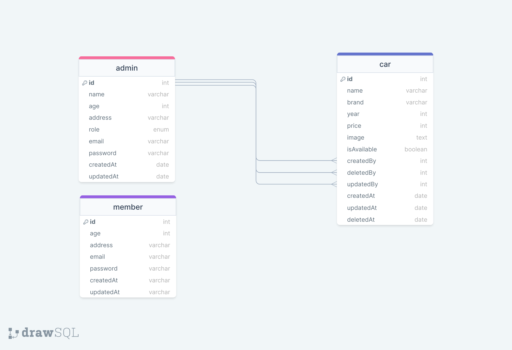

# Challenge 5

## Car Management API and OpenAPI

### Entity Relational Diagram

Before start coding we should make an ERD because this can help us when we generate the models.


### Installations

Install dependencies for this project

```shell
npm install
```

### Set .env

```shell
DB_USERNAME=
DB_PASSWORD=
DB_NAME=
PORT=
JWT_SECRET=

IMAGEKIT_PUBLIC_KEY=
IMAGEKIT_PRIVATE_KEY=
IMAGEKIT_URL=
```

### Database

#### Create Database

```shell
sequelize db:create
```

#### Migrate Database

```shell
sequelize db:migrate
```

#### Seed Database

```shell
sequelize db:seed:all
```

### Server

```shell
npm run dev
localhost:8000/
```

### OpenAPI

```shell
localhost:8000/api-docs
```

First you should login with superadmin account

```shell
{
    "email": "zan@gmail.com",
    "password": "zan123"
}
```

After that you can access all API.
